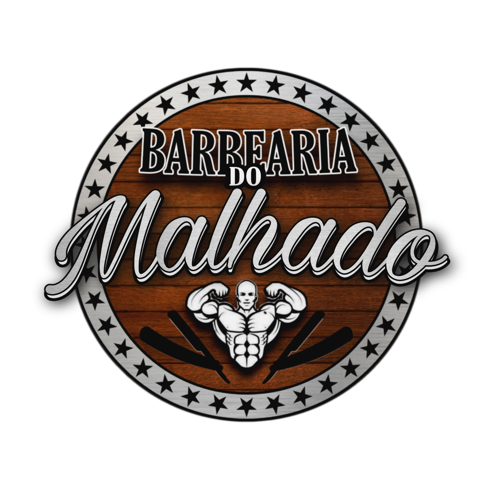

<div align="center">
  
</div>

<h1 align='center'>
 <p>Barber Shop</p>
</h1>


### 📕 About

Website created in 2020 for a barbershop in the region, in order to prospect more customers.

#

<div align="center">
  
</div>

#

### ❓ Why the app

I was a customer and noticed that this small business didn't have a website.

As I was starting out in programming, I decided to create a website and offer it for free to entrepreneurs as a challenge.

#

### ⛏️ Tools used

- [HTML](https://developer.mozilla.org/en-US/docs/Web/HTML)
- [CSS](https://developer.mozilla.org/pt-BR/docs/Web/CSS)

#

### 🤝🏽 How to contribute

You need to have [Node](https://nodejs.org/en/download), [Git](https://git-scm.com/download/win) and [VsCode](https://code.visualstudio.com/download) installed on your computer.


#### Follow the step by step

````bash
    # Clone the project
    $ git clone git@github.com:dan-ia/Barbershop-Site.git

    # Enter directory
    $ cd Barbershop-Site

     # Open project in VsCode
     code .
````
<div align="center">

<br>

<h3> Any questions? Contact me! 🩵✌️</h3>

[](https://www.linkedin.com/in/dan-ia/)
[](mailto:danieillsilvarv411@gmail.com)


</div>

